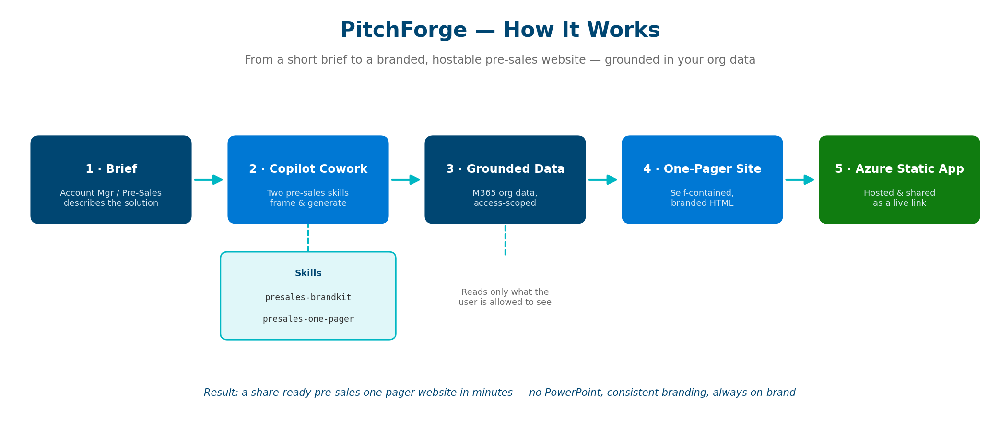
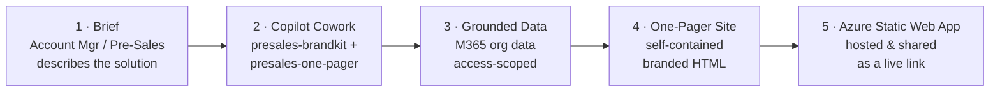

# PitchForge

### Technical Pre-Sales One-Pager Studio — powered by Copilot Cowork

> Turn a short brief into a branded, share-ready pre-sales **website** —
> grounded in your org data, hostable on Azure as a static web app.
> No PowerPoint required.


---

## 🧭 Table of Contents
- [The Problem](#-the-problem)
- [The Solution](#-the-solution)
- [Why a Website Beats a Deck](#-why-a-website-beats-a-deck)
- [How It Works](#-how-it-works)
- [The Two Skills](#-the-two-skills)
- [Grounded in Org Data](#-grounded-in-org-data)
- [Repository Structure](#-repository-structure)
- [Try It Yourself](#-try-it-yourself)
- [Getting Started](#-getting-started)
- [Deploy to Azure Static Web Apps](#-deploy-to-azure-static-web-apps)
- [Value Delivered](#-value-delivered)
- [Team](#-team)

---

## 🎯 The Problem

Every technical pre-sales motion needs a crisp, on-brand artefact to put in
front of a prospect. Today that artefact is almost always a **PowerPoint deck** —
and building one is slow and inconsistent:

- **Manual assembly** — Account Managers, Pre-Sales Specialists, and Solution
  Specialists hand-build each deck from scratch, copying details out of
  proposals, architecture docs, and emails.
- **Inconsistent branding** — every author re-applies fonts, colours, and logos
  differently, so two decks for the same company rarely look alike.
- **Hard to share and reuse** — decks live as email attachments and file
  versions; there is no clean link to send and no single source of truth.
- **Static format** — a slide cannot host a live demo link, scroll as a
  narrative, or be opened on any device without the file.
- **Time pressure** — pulling a polished one-pager together for a prospect can
  take hours that pre-sales teams do not have.

## 💡 The Solution

**PitchForge** is a Copilot Cowork solution made of **two skills** that turn a
short brief into a polished, single-page **website** — the modern replacement
for a one-slide pitch.

A pre-sales specialist simply describes the solution in plain language inside
Copilot Cowork. PitchForge:

1. Applies a locked **brand identity** (colours, type, logo rules, tone, voice).
2. **Grounds** the content in the user's Microsoft 365 org data — proposals,
   architecture docs, people, meetings — **scoped to what that user is allowed
   to see**.
3. Generates a **self-contained HTML one-pager** (all CSS inlined, no
   dependencies) with navigation, hero, challenge, solution, tech stack,
   architecture flow, impact metrics, and a contributor grid.
4. Hands back a file that drops straight into **Azure Static Web Apps** and
   becomes a **live link** the team can send to a prospect.

The result: pre-sales teams produce a consistent, on-brand, hostable pre-sales
site in minutes instead of hours — and never open PowerPoint.

## ⚖️ Why a Website Beats a Deck

| | Traditional PowerPoint | PitchForge one-pager site |
|---|---|---|
| **Creation time** | Hours of manual assembly | Minutes from a short brief |
| **Branding** | Re-applied by hand, inconsistent | Locked brand kit, identical every time |
| **Sharing** | Email attachment + file versions | A single live URL |
| **Access** | Needs the file + the app | Opens in any browser, any device |
| **Live links / demos** | Not native | Embedded, clickable |
| **Hosting** | None | Azure Static Web Apps |
| **Maintenance** | Edit the file, resend | Update once, the link reflects it |
| **Anonymisation** | Manual, error-prone | Built-in, verified on every build |

## 🏗️ How It Works





**Step by step:**

1. **Brief** — The pre-sales user describes the client, use case, solution,
   challenges, tech stack, value, and contributors in natural language.
2. **Copilot Cowork** — The two skills frame the content: `presales-brandkit`
   enforces the visual identity and tone; `presales-one-pager` structures the
   page and writes the copy.
3. **Grounded data** — Cowork pulls supporting facts from the user's Microsoft
   365 (files, emails, people, meetings), **only within that user's access**.
4. **One-pager site** — A self-contained HTML file is produced, fully branded
   and responsive, with a sticky nav and all mandatory sections.
5. **Azure Static Web App** — The file is committed and deployed; the team
   shares a clean URL with the prospect instead of a slide attachment.

## 🧩 The Two Skills

PitchForge is composed of two layered Cowork skills. The full definitions are
bundled in this repo under [`/skills`](skills) so the solution is reproducible.

### 1. `presales-brandkit` — the identity layer
[`skills/presales-brandkit/SKILL.md`](skills/presales-brandkit/SKILL.md)

The single source of truth for visual identity. It defines the colour palette,
typography scale, logo placement and fallback rules, tone of voice (with banned
hype phrases), layout principles, **anonymisation rules**, contributor display
rules, accessibility baseline (WCAG 2.1 AA), and a validation checklist. Every
deliverable composes inside it — colours, type, and voice never bend.

### 2. `presales-one-pager` — the generator layer
[`skills/presales-one-pager/SKILL.md`](skills/presales-one-pager/SKILL.md)

A scenario-aware generator that turns a brief into the finished one-pager
website. It owns the section structure (hero, challenge, solution, tech stack,
architecture flow, impact, outcomes, references, contributors, footer), the
brief-intake protocol, four composition patterns (Metric-Led, Story-Led,
Tech-Led, Outcome-Led), and the pre-delivery validation gate. It **never**
re-defines branding — it always invokes `presales-brandkit` first.

## 🔒 Grounded in Org Data

PitchForge is grounded, not generative-guesswork:

- Content is pulled from the user's **Microsoft 365** — SharePoint/OneDrive
  files, Outlook emails, people directory, and meetings.
- Retrieval is **access-scoped**: Cowork only reads what the signed-in user is
  already permitted to see. No elevation, no cross-tenant reach.
- Facts that cannot be found are left as **clearly-marked placeholders**
  (`[Add exact ROI]`) — the solution never fabricates numbers, names, or dates.
- When anonymisation is requested, the real client name is stripped from
  **every** location — body, title, file name, comments, and metadata — and
  verified on each build.

## 📁 Repository Structure

```
pitchforge/
├── README.md                          # You are here
├── assets/
│   └── architecture.png               # Process / architecture diagram
├── skills/
│   ├── presales-brandkit/SKILL.md     # Brand identity skill
│   └── presales-one-pager/SKILL.md    # One-pager generator skill
└── samples/
    ├── resolveiq-sample-brief.md      # Sample brief to paste into Cowork
    └── ResolveIQ-OnePager.html        # The generated sample one-pager site
```

## 🧪 Try It Yourself

A complete, working sample is included so anyone can reproduce the result:

1. Open [`samples/resolveiq-sample-brief.md`](samples/resolveiq-sample-brief.md)
   and copy the prompt + brief.
2. Paste it into **Copilot Cowork** (with the two skills installed).
3. Cowork generates a one-pager website identical in style to the included
   sample: [`samples/ResolveIQ-OnePager.html`](samples/ResolveIQ-OnePager.html).
4. Open the generated HTML in any browser to preview, then deploy it (below).

> **ResolveIQ** is the bundled sample — an AI-powered IT support agent built for
> a leading enterprise SaaS & cloud infrastructure provider (client anonymised).
> It is a finished example of what PitchForge produces from a single brief.

## 🚀 Getting Started

**Prerequisites**
- Access to **Copilot Cowork** in your Microsoft 365 tenant.
- The two skills installed in your personal Cowork skills folder
  (`presales-brandkit` and `presales-one-pager`) — copy the folders from
  [`/skills`](skills) into your Cowork skills location.

**Generate a one-pager**
1. In Cowork, invoke both skills and describe your solution (use
   [the sample brief](samples/resolveiq-sample-brief.md) as a template).
2. Cowork returns a self-contained `*-OnePager.html` file.
3. Review the placeholder list it reports and fill any `[Add …]` gaps.

## ☁️ Deploy to Azure Static Web Apps

Because the output is a single self-contained HTML file, hosting is trivial.

**Option A — Azure Portal**
1. Put the generated HTML in a repo, renamed `index.html` (or add a small
   `staticwebapp.config.json` to set the entry point).
2. In the Azure Portal: **Create resource → Static Web App**.
3. Connect this GitHub repo, set **App location** to the folder holding the
   HTML, leave **API location** blank, and create.
4. Azure provisions a CI/CD workflow and gives you a public `*.azurestaticapps.net`
   URL to share. `[Add your deployed URL]`

**Option B — Azure CLI (SWA)**
```bash
npm install -g @azure/static-web-apps-cli
swa deploy ./samples --app-name pitchforge --env production
```

> Tip: rename the one-pager to `index.html` so it loads as the site root.

## 📊 Value Delivered

For the pre-sales function, PitchForge delivers:

- **Hours → minutes** to produce a client-ready pre-sales artefact.
- **One consistent brand** across every Account Manager, Pre-Sales, and
  Solution Specialist — no off-brand decks.
- **A live link, not an attachment** — easier to share, open, and update.
- **Grounded accuracy** — content drawn from real org data within the user's
  access, with placeholders instead of fabrication.
- **Reusable pattern** — the same two skills work for any solution type, from
  Copilot agents to cloud migrations.

## 👥 Team

| Name | Role |
|------|------|
| Shrushti Shah | Senior Consultant & Solution Architect |

---

*Built with Microsoft Copilot Cowork. Sample client identity anonymised.
— for pre-sales and hackathon use.*
